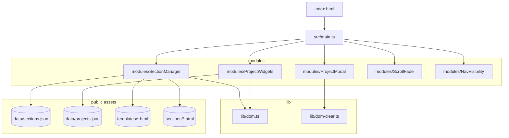

# Node Map (Module & Function Graph)

Dependency and call graph for the Vite + TypeScript code. Modules live in `src/`. Static assets and JSON live in `public/`.

## Module Graph

- src/main.ts
  - imports: `onReady` (src/lib/dom.ts)
  - imports: `SectionManager` (src/modules/SectionManager.ts)
  - imports: `ProjectWidgets` (src/modules/ProjectWidgets.ts)
  - imports: `ProjectModal` (src/modules/ProjectModal.ts)
  - imports: `initScrollFade` (src/modules/ScrollFade.ts)

- src/modules/SectionManager.ts
  - imports: `htmlToFragment`, `loadJSON`, `loadText` (src/lib/dom.ts)

- src/modules/ProjectWidgets.ts
  - imports: `h`, `loadJSON` (src/lib/dom.ts)

- src/modules/ProjectModal.ts
  - imports: `clearChildren` (src/lib/dom-clear.ts)

- src/modules/ScrollFade.ts
  - no imports

- src/lib/dom.ts
  - exports DOM helpers & fetchers

- src/lib/dom-clear.ts
  - exports `clearChildren`

## Runtime Flow (main)

1) `onReady(...)` → boot
- set footer year
- `initScrollFade()`
- SectionManager: `new SectionManager(main, src).load()`
- `ProjectWidgets.initAuto()` (renders projects from JSON into any `[data-projects-src]` containers)
- if `#project-modal` exists: `new ProjectModal(modalEl)` and expose `window.ProjectModal.open`

## SectionManager (src/modules/SectionManager.ts)

- class SectionManager
  - private `ensureSectionStructure(frag, item?)` → ensures `<section>` has `id` and `.container` wrapper
  - private `insertSection(item)`
    - decides source: `src` | `template` | `html`
    - fetches via `loadText()`
    - converts via `htmlToFragment()`
    - normalizes via `ensureSectionStructure()` when needed
    - appends to container
  - public `load()`
    - fetches `sections.json` via `loadJSON()`
    - iterates and awaits `insertSection()` for each item

## ProjectWidgets (src/modules/ProjectWidgets.ts)

- class ProjectWidgets (all static)
  - `cardFromProject(p: Project)` → HTMLElement card
  - `applyWidgetStyles(container, styles?)`
  - `renderGallery(container, projects)` → append cards
  - `loadAndRender(container, url)` → fetch `ProjectsFile` via `loadJSON()`, apply styles, render
  - `initAuto()` → finds legacy `#project-gallery-json` and any `[data-projects-src]` containers and calls `loadAndRender`

Data dependencies:
- `public/data/projects.json` (array or object with `projects`)

## ProjectModal (src/modules/ProjectModal.ts)

- class ProjectModal
  - private state: `currentIndex`, `images`, `lastFocus`
  - private `els` getter: caches DOM nodes in modal
  - private `setGallery(idx)` → slide track translate, toggle nav visibility
  - private `fillFromData(data)` → sets title/time/desc, chips, links, images
  - public `openFromCard(card)` → extracts data from a `.project-card` to populate modal, then opens
  - public `open(data)` → programmatic open with `ProjectModalData`
  - public `close()` → hide modal, restore focus
  - private `init()` → wires events (click prev/next/close, overlay click, Esc/Arrows, delegate `.details-trigger`)

Events:
- Document `click` delegates `.details-trigger` to `openFromCard`
- Document `keydown` handles `Escape`, `ArrowLeft`, `ArrowRight`

## ScrollFade (src/modules/ScrollFade.ts)

- `initScrollFade()`
  - if reduced motion → add `.in-view` to all `.section`
  - else create `IntersectionObserver` to toggle `.in-view`
  - fallback to scroll/resize handler when IO unavailable

## DOM Helpers (src/lib/dom.ts)

- `onReady(fn)` → DOMContentLoaded helper
- `loadText(url)` → fetch HTML
- `loadJSON<T>(url)` → fetch JSON typed
- `htmlToFragment(html)` → parse to `DocumentFragment`
- `h(tag, props?, children?)` → lightweight hyperscript for element creation

## DOM Utils (src/lib/dom-clear.ts)

- `clearChildren(el)` → remove all children

## External Assets

- `public/data/sections.json` → section configuration
- `public/templates/*` → section skeletons
- `public/sections/*` → static fragments
- `public/styles/*` → CSS layers for layout, sections, widgets
- `public/icons/*` → SVGs/images

## High-level Graph (text)

- main.ts
  -→ initScrollFade
  -→ SectionManager.load
    -→ loadJSON (dom.ts)
    -→ loadText + htmlToFragment (dom.ts)
  -→ ProjectWidgets.initAuto
    -→ loadAndRender
      -→ loadJSON (dom.ts)
  -→ ProjectModal (if present)
    -→ init event wiring
    -→ open/openFromCard/close

## Mermaid Summary

